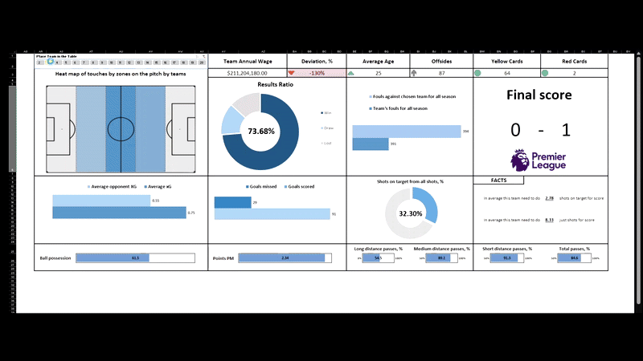
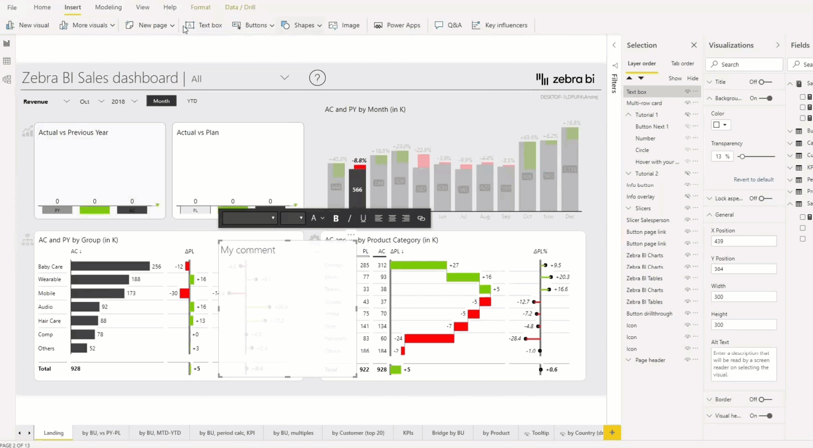

## Welcome to my GitHub!  
I,m an Engineer with experience in Development and Data Analisys. I'm a detail-oriented professional, committed to learning and using new technologies to create innovative solutions. 
My passion for continuous learning keeps me updated on industry trends, ensuring I deliver excellent results.

## 📊 Portfolio

|    |    |
|----------|---------|
| 
[Excel EPL Analysis Project](https://github.com/artemrudman/Excel_Project_Liverpool)    
| 
[Demographic analysis with Python](https://github.com/artemrudman/python_data_analysis)     
 |
| 
[Darkstore Market](https://github.com/artemrudman/Darkstore_market)    
| 
[Web Servers Monitoring System](https://github.com/artemrudman/Webservers_Project/)     
|

  
## 💻 Technical skills
- Languages: SQL, Python, JS, TS
- Databases: Microsoft SQL Server, MySQL, PostgreSQL
- Spreadsheets: Excel, Google Sheets
- Data Visualization: Power BI
- Data Wrangling: data cleaning, data transformation, data integration

## 🎓 Education
Bachelor's degree in Oil and Gas engineering, Siberian Federal University

## 📧 Let's connect!
[My LinkedIn](https://www.linkedin.com/in/artem-rudman/)🌍🚀

Take a look at my projects here on GitHub. If you have any questions or would like to collaborate, please feel free to contact me!
